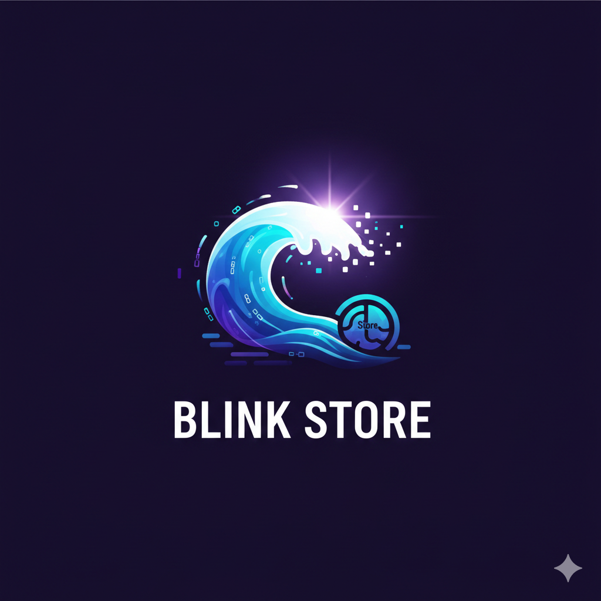

<p align="center">
  
</p>

<h1 align="center">Blink Store</h1>

<p align="center">
  <strong>Blazing-fast in-memory key-value store. Single binary. Any language.</strong>
</p>

<p align="center">
  <a href="https://github.com/ashokdudhade/blink-store/releases"></a>
  <a href="https://github.com/ashokdudhade/blink-store/actions"></a>
  <a href="https://ashokdudhade.github.io/blink-store/"></a>
  <a href="https://ghcr.io/ashokdudhade/blink-store"></a>
</p>

---

Blink Store is a blazing-fast in-memory key-value store built in Rust. It ships as a **single binary** with no runtime dependencies — download it, run it, and connect from any language over TCP. Sub-50 µs median latency. 16K+ ops/sec on a single connection.

Designed for teams that need a **simple, fast local cache** without the overhead of Redis, Memcached, or an external service. Install in seconds, configure with flags, integrate with a few lines of socket code.

## Features

| | |
|:---|:---|
| **Single binary, zero config** | One `curl` command to install. One flag to start. No config files, no daemon setup. |
| **Works with every language** | Plain-text TCP protocol. If your language can open a socket and send a line of text, it works. |
| **Smart memory management** | Set a byte limit with `--memory-limit`. Sampled eviction (like Redis) automatically reclaims space. |
| **Written in Rust** | No `unsafe` code. `Result`-based error handling throughout. Structured logging via `tracing`. |
| **Concurrent by design** | `DashMap` for lock-free reads. Tokio async runtime. Each connection is a lightweight task. |
| **Cross-platform** | Pre-built binaries for Linux, macOS, and Windows (x86_64 and ARM64). Also runs in Docker. |

## Quick Start

Install and run in two commands — no Git clone, no Rust toolchain:

```bash
curl -sSLf https://raw.githubusercontent.com/ashokdudhade/blink-store/main/scripts/install-from-github.sh \
  | bash -s -- latest ./bin

./bin/blink-store serve --tcp 127.0.0.1:8765
```

Then from another terminal:

```bash
echo "SET user alice" | nc 127.0.0.1 8765    # → OK
echo "GET user"       | nc 127.0.0.1 8765    # → VALUE YWxpY2U=
echo "USAGE"          | nc 127.0.0.1 8765    # → USAGE 9
echo "DELETE user"    | nc 127.0.0.1 8765    # → OK
```

> `VALUE` responses are base64-encoded. Decode: `echo YWxpY2U= | base64 -d` → `alice`.

## Docker

```bash
docker run -d --name blink-store \
  -p 8765:8765 \
  -e BLINK_MEMORY_LIMIT=10485760 \
  ghcr.io/ashokdudhade/blink-store:latest
```

## Protocol

Five commands. That's the entire API.

| Command | Example | Response |
|---------|---------|----------|
| `SET key value` | `SET user alice` | `OK` |
| `GET key` | `GET user` | `VALUE YWxpY2U=` |
| `DELETE key` | `DELETE user` | `OK` or `NOT_FOUND` |
| `USAGE` | `USAGE` | `USAGE 9` |
| `QUIT` | `QUIT` | *(connection closed)* |

## Documentation

Full documentation is available at **[ashokdudhade.github.io/blink-store](https://ashokdudhade.github.io/blink-store/)**, including:

- [Installation](https://ashokdudhade.github.io/blink-store/docs/installation)
- [Protocol Reference](https://ashokdudhade.github.io/blink-store/docs/protocol)
- Language Guides — [Python](https://ashokdudhade.github.io/blink-store/docs/guides/python) · [Node.js](https://ashokdudhade.github.io/blink-store/docs/guides/nodejs) · [Go](https://ashokdudhade.github.io/blink-store/docs/guides/go) · [Shell](https://ashokdudhade.github.io/blink-store/docs/guides/shell) · [Rust](https://ashokdudhade.github.io/blink-store/docs/guides/rust)
- [Deployment](https://ashokdudhade.github.io/blink-store/docs/deployment)
- [Benchmarks](https://ashokdudhade.github.io/blink-store/docs/benchmarks)

## License

MIT
